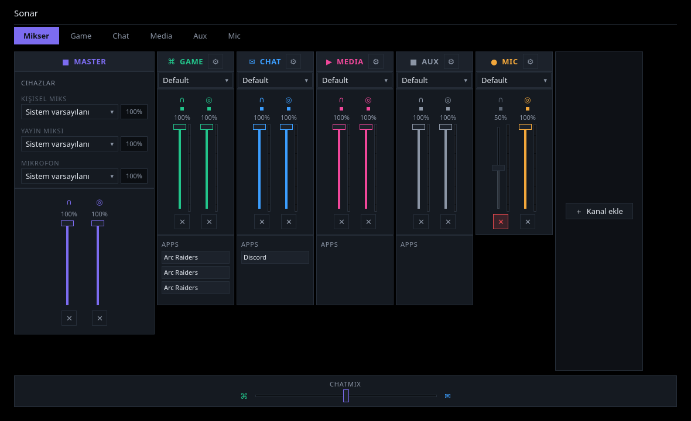
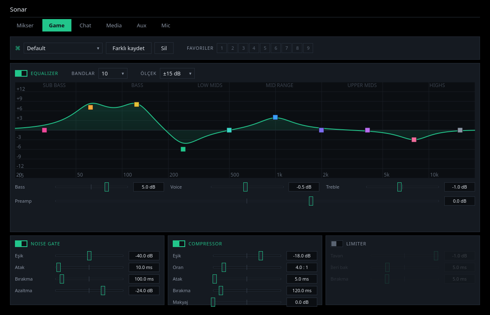
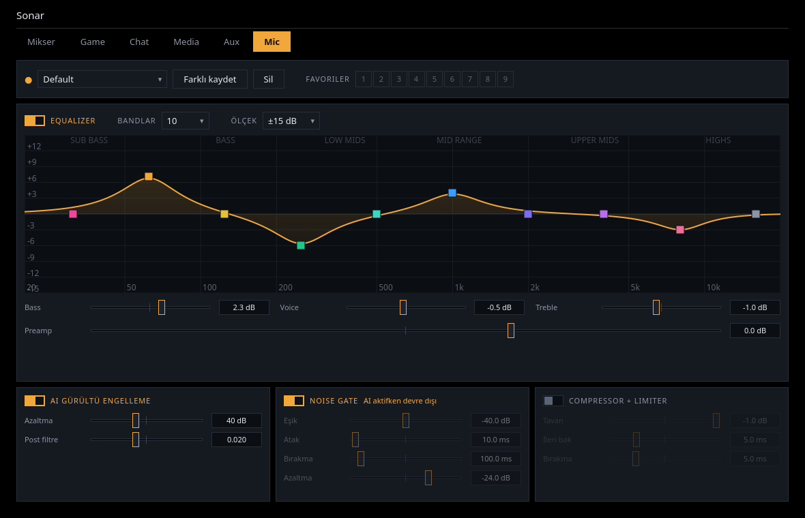

# Sonar

**Linux için kanal tabanlı ses mikseri.** SteelSeries GG'nin Sonar modülünün yaptığı işi
PipeWire üzerinde native olarak yapar: uygulamaları adlandırılmış kanallara ayırır, her
kanala kendi EQ ve filtre zincirini verir ve **kulaklığına giden ses ile yayına giden sesi
birbirinden ayırır.**



---

## Neden

Linux'ta EasyEffects sistem geneli **tek** bir efekt zinciri sunuyor, qpwgraph elle
yamalama yaptırıyor. İkisinde de "kanal" kavramı ve kişisel/yayın miks ayrımı yok.

Sonar bunları veriyor:

* **Kanallar** — Oyun, Sohbet, Medya, Diğer (+ istediğin kadarını ekle). Uygulamalar açıldıkları
  anda doğru kanala düşer.
* **Çift miks** — her kanalın iki bağımsız fader'ı var: 🎧 kulaklık, 📡 yayın. Telifli
  müziği kendin duyarsın, yayında duyulmaz.
* **Kanal başına DSP** — EasyEffects'in kullandığı LSP eklentileriyle aynı kalitede
  ekolayzer, noise gate, kompresör, limiter. Mikrofonda ayrıca DeepFilterNet AI gürültü
  engelleme.
* **Profiller** — bir kanal için istediğin kadar profil kaydet, aralarında **anında ve
  kesintisiz** geçiş yap. (Ölçüldü: 3.4 saniyede 12 geçiş, 0 kesinti.)
* **OBS uyumu** — birleşik yayın miksi ve kanal başına ayrı yakalama noktaları.
* **ChatMix** — tek slider'la oyun ↔ sohbet dengesi. Yalnızca kulaklığını etkiler, yayını
  bozmaz.

---

## Ekranlar

| Mikser | Kanal FX |
|---|---|
|  |  |

Mikrofon sayfası, AI gürültü engelleme açıkken Noise Gate'i devre dışı bırakır:



---

## Kurulum

Hazır paket **yalnızca Arch tabanlı dağıtımlar** için var (Arch, CachyOS, EndeavourOS,
Manjaro). Başka bir dağıtımdaysan Sonar yine çalışır — PipeWire ve LSP eklentileri her
yerde bulunur — ama kurulumu elle yapman gerekir: [Kurmadan
denemek](#kurmadan-denemek) bölümü depodan çalıştırmayı anlatıyor.

### Arch / CachyOS

```bash
git clone https://github.com/iwhimss/sonar
cd sonar/packaging
makepkg -si
```

Bu kadar. `makepkg` bağımlılıkları kendisi kurar ve şunları yerine koyar:

| Ne | Nereye |
|---|---|
| `sonar`, `sonar-cli`, `sonar-daemon`, `sonar-uninstall` | `/usr/bin` |
| Uygulama kısayolu ve ikon | uygulama menüsü |
| systemd kullanıcı servisi | `sonar-daemon.service` |
| D-Bus etkinleştirme | arayüz açılınca daemon kendiliğinden kalkar |
| Kulaklık teker kuralı | `/usr/lib/udev/rules.d` |

**İsteğe bağlı eklentiler** — efekt kataloğunun bir kısmı bunlara dayanıyor, kurulu
olmayanlar "Efekt ekle" listesinde hiç görünmez:

```bash
sudo pacman -S calf zam-plugins-ladspa   # Yankı, Exciter, De-esser, Maximizer…
paru -S deepfilternet-plus-bin           # AI gürültü engelleme (mikrofon, AUR)
```

`zam-plugins` **değil** `zam-plugins-ladspa`: ilki bir meta paket, kendisi hiçbir LADSPA
dosyası kurmuyor ve altı ayrı yapıyı birden çekiyor.

**EasyEffects'e gerek yok.** Sonar aynı LSP ve Calf eklentilerini doğrudan kullanıyor;
EasyEffects onları yalnızca kendi *isteğe bağlı bağımlılığı* olarak getirdiği için ikisi
karıştırılabiliyor. Sonar'ın kurulumu `lsp-plugins-lv2`'yi zaten zorunlu bağımlılık
olarak çekiyor.

Kulaklık tekerinin okunabilmesi için udev kuralının bir kez yüklenmesi gerekiyor
(kurulumdan sonra kulaklığı çıkarıp takmak da yeterli):

```bash
sudo udevadm control --reload && sudo udevadm trigger
```

### İlk açılış

Uygulamayı aç. Daemon çalışmıyorsa arayüz onu kendisi başlatır (D-Bus etkinleştirmesi;
depodan çalıştırıyorsan ekrandaki **Servisi başlat** düğmesi).

İlk açılışta kısa bir tanıtım gelir: dil seçimi, Sonar'ın ne yaptığı, hangi sanal
cihazların oluşturulacağı ve **Sanal kanalları kur** düğmesi. Düğmeye basana kadar
PipeWire'a hiçbir şey yazılmaz — sistemin sesi olduğu gibi kalır.

Terminalden yapmak istersen aynı iş:

```bash
sonar-cli install       # sanal kanalları kur
sonar-cli uninstall     # kaldır (ayarlar diskte kalır)
```

### Oturum açılışında başlasın

**Ayarlar → Oturum açılışında başlat** altında iki kutucuk var:

* **Ses düzeni hazır olsun** — kanallar oturum açılır açılmaz kurulur, arayüzü hiç
  açmasan bile ses düzenin yerinde olur.
* **Arayüz de açılsın (tepside)** — pencere açılmaz, uygulama sistem tepsisinde bekler.

İkisi de isteğe bağlı ve istediğin zaman kapatılabilir. Terminalden karşılığı:

```bash
systemctl --user enable --now sonar-daemon
```

### Kurmadan denemek

Sisteme hiçbir şey kurmadan, depodan çalıştırabilirsin:

```bash
python -m venv .venv && source .venv/bin/activate
pip install -e .

./scripts/sonar-dev start     # daemon (kanal kurmaz)
./scripts/sonar-dev gui       # arayüz — karşılama ekranı buradan
./scripts/sonar-dev status
./scripts/sonar-dev stop      # her şeyi durdur
```

Daemon durduğunda çalan uygulamalar **kendiliğinden** varsayılan cihaza geri döner; ses
kesilmez.

> **EasyEffects çalışıyorsa önce durdur** (`pkill easyeffects`) — ikisi aynı anda
> çalışamaz, bkz. [Bilinen sınırlar](#bilinen-sınırlar).

### Dil

Arayüz Türkçe ve İngilizce. Varsayılan Türkçe; **Ayarlar → Dil**'den anında değişir,
uygulamayı yeniden başlatmak gerekmez.

Kanal ve cihaz adları dilden **bağımsız**: OBS'te seçtiğin `Sonar Stream Mix` aygıtı dil
değiştirdiğinde kaybolmaz ve bu belgedeki adlar her dilde geçerli kalır. Arayüzde
gördüğün "Oyun / Sohbet / Medya" yalnızca gösterilen ad; kanalı kendin adlandırırsan
senin adın her dilde geçerli olur.

Terminalden: `sonar-cli lang en`

### Gereksinimler

| Bileşen | En az |
|---|---|
| PipeWire | 1.0 (1.6 ile geliştirildi ve test edildi) |
| WirePlumber | 0.5 |
| Python | 3.11 |
| PySide6 | 6.6 |
| `lsp-plugins-lv2` | 1.2 — **zorunlu**, DSP zinciri buna dayanıyor |
| `calf`, `zam-plugins-ladspa` | isteğe bağlı — yankı, exciter, de-esser, maximizer |
| `deepfilternet-plus-bin` | isteğe bağlı (AUR), yalnızca AI gürültü engelleme için |

Kurulu olmayan bir eklenti zincirden **sessizce düşer** — graf yine kurulur, o efekt
görünmez.

---

## Hızlı başlangıç

```bash
sonar-cli status                       # kanallar, fader'lar, çalan uygulamalar
sonar-cli doctor                       # ses gelmiyorsa ilk buraya bak
sonar-cli volume game output 70        # oyun sesini kendi çıkışında %70 yap
sonar-cli volume media stream 0        # müziği yayından çıkar
sonar-cli presets game                 # hazır preset'ler
sonar-cli profile game "FPS Footsteps" # anında geçiş
sonar-cli meters                       # terminalde canlı seviye metreleri
```

Kanallar ve profiller:

```bash
sonar-cli channel add "Müzik"                    # yeni çıkış kanalı
sonar-cli channel add "Podcast" --direction input # yeni giriş kanalı (sanal mikrofon)
sonar-cli channel remove aux                     # kullanmadığın kanalı sil

sonar-cli new game "CS2"                # sıfırdan düz bir profil, hemen etkin
sonar-cli favorite add game "CS2"       # hızlı geçiş için favorilere
sonar-cli favorite list game

sonar-cli obs game on                   # bu kanalı OBS'e ayrı bir kaynak olarak ver
```

Mikrofon yönlendirme ve efektler:

```bash
sonar-cli route Discord mic --direction in   # Discord hangi mikrofonu kullansın
sonar-cli move 142 stream_mic                # çalan bir mikrofon akışını taşı

sonar-cli smart chat on --reduction-db -12   # Chat konuşunca diğerlerini kıs
```

Kulaklığın için AutoEQ düzeltme eğrisi varsa doğrudan içe aktarabilirsin:

```bash
sonar-cli import game ~/İndirilenler/HD650\ ParametricEQ.txt --name HD650
```

AutoEQ, Equalizer APO (Windows) ve EasyEffects preset'leri destekleniyor; biçim dosyanın
içeriğinden bulunuyor. Arayüzde de "İçe aktar" / "Dışa aktar" düğmeleri var.

**Profillerde "kaydet" yok.** Yaptığın her değişiklik aktif profile yazılır ve yarım
saniye içinde diske geçer. Yeni bir varyant istiyorsan **＋ Yeni profil** de: isim sorar,
sıfırdan düz bir profil açar, eskisine dokunmaz. Gömülü bir preseti kurcalarsan
kendiliğinden `<ad> (özel)` kopyası açılır — preset bozulmaz.

---

## Kanallar ve sanal cihazlar

Her kanal bir sanal ses cihazı üretir ve adı yönünü söyler:

| Cihaz | Ne işe yarar |
|---|---|
| `Sonar Game — Virtual Output` | Uygulamalar buraya çalar (çıkış kanalı) |
| `Sonar Mic — Virtual Input` | İşlenmiş mikrofon (giriş kanalı) — Discord bunu seçer |
| `Sonar Stream Mix` | Yayın miksi — **OBS'te Masaüstü Sesi olarak bunu seç** |
| `Sonar Stream Mix (alternatif giriş)` | Aynı miksin ikinci yolu; ikisini birden ekleme |
| `Sonar Personal Mix` | Kulaklığına giden miks |

Mikrofon **varsayılan olarak yayın miksinin içinde**, yani OBS'te tek kaynak yeter.
Ayrı track isteyenler master şeridindeki "Yayın kurulumu…" penceresinden kapatabilir.
Ayrıntı: [`docs/OBS.md`](docs/OBS.md).

Kanal eklerken **çıkış** mı **giriş** mi olduğunu seçersin; buna göre sink mi source mu
oluşturulacağı belirlenir. Her kanal silinebilir — kullanmadığın Aux'u atabilirsin.
Tek kısıt: en az bir çıkış ve en az bir giriş kanalı kalmalı.

Kanal başına ayrı OBS kaynağı **varsayılan olarak kapalı**. Açık olsaydı her çıkış kanalı
sistemin mikrofon listesinde de görünürdü ("Media neden mikrofon?"). Yayında kanal başına
ayrı track istiyorsan `sonar-cli obs <kanal> on` ile açarsın.

### Mikrofon yönlendirme

Uygulamalar hem çıkış kanallarında hem giriş kanallarında görünür: Discord'un sesi
`Chat`'te, mikrofonu `Mic` zincirinde. Kutucuklardaki `OUT` / `IN` rozeti hangisi
olduğunu söyler ve ikisi birbirinden bağımsız taşınabilir. Kurallar da yön taşır
(`--direction in`), yani "Discord sesi chat'e, mikrofonu stream_mic'e" yazılabilir.

Masaüstü sesini yakalayan uygulamalar (cava, OBS'in "Masaüstü Sesi" kaynağı) mikrofon
kullanıcısı sayılmaz ve yönlendirilmez — `stream.capture.sink` bayrağıyla ayırt ediliyor.

---

## Efektler

Her kanalın kendi efekt zinciri var ve zinciri **sen kuruyorsun**. Yeni bir profil
yalnızca ekolayzerle gelir; gerisini FX sayfasındaki **＋ Efekt ekle** ile eklersin,
sürükleyerek sıralarsın. Sinyal listedeki sırayla akar.

| Grup | Efektler |
|---|---|
| Dinamikler | Gürültü Kapısı, Genişletici, Kompresör, De-esser, Maximizer, Limitleyici |
| Tını | Ekolayzer (32 band, sürüklenebilir eğri), Bas Zenginleştirici, Exciter, Gürlük Dengeleme |
| Uzam | Stereo Araçları, Gecikme, Yankı, Uzamsal Ses (crossfeed) |
| Yardımcı | Ses Yükseltme, AI Gürültü Engelleme (yalnızca mikrofon) |

EasyEffects'in kullandığı LSP, Calf ve Zam eklentileriyle — yani aynı DSP, kanal başına.

Her panelin başlığında **↺** var: o efektin tüm ayarlarını varsayılana döndürür. Ekolayzerde
bandları düzler, sayılarını korur.

**Ne kesinti yaratır:** efekt eklemek, silmek ve sıralamak ses grafını yeniden kurar
(~200 ms sessizlik) — nedeni `ARCHITECTURE.md`'de. Efekti açıp kapatmak, parametre
çevirmek, **sıfırlamak** ve aynı efekt listesine sahip profiller arasında geçmek
**kesintisiz**.

Zincire girmeyenler: Convolver (IR dosyası desteği henüz yok), çok bandlı kompresör/gate,
Auto Gain, tek bandlı Filtre. Nedenleri `ARCHITECTURE.md`'de.

---

## Nasıl çalışıyor

Üç süreç:

```
sonar (arayüz)  ──D-Bus──▶  sonar-daemon  ──▶  pipewire -c graph.conf
                                                (tüm sanal cihazlar)
```

Arayüz kapalıyken ses düzeni bozulmaz — grafı daemon taşır. Ayrıntı için
[ARCHITECTURE.md](ARCHITECTURE.md).

---

## Ölçümler

Her sayı gerçek donanımda ölçüldü, ayrıntısı [docs/PERFORMANCE.md](docs/PERFORMANCE.md):

| | |
|---|---|
| Eklenen gecikme | **1.1 ms** (ölçüm gürültüsünün içinde) |
| Ekolayzer doğruluğu | çizilen eğri ile gerçek yanıt arasında **0.01 dB** |
| Profil geçişi | 12 geçişte **0 kesinti, 0 tık** |
| Boştaki CPU | %5–7 (mikser açıkken %12–13) |
| Kanal izolasyonu | kanallar arası sızıntı **-240 dBFS** (dijital sessizlik) |
| Spatial Audio | altı zincir için **+%1.8** CPU |
| Bellek | ~180–200 MB |
| DeepFilterNet açıkken | **+%43** — pahalı, bilerek kullan |

---

## Belgeler

* [ARCHITECTURE.md](ARCHITECTURE.md) — ses grafı, D-Bus API, tasarım kararları
* [docs/OBS.md](docs/OBS.md) — yayın kurulumu, çok track'li kayıt
* [docs/PERFORMANCE.md](docs/PERFORMANCE.md) — tüm ölçümler
* [docs/TROUBLESHOOTING.md](docs/TROUBLESHOOTING.md) — sorun giderme
* [CONTRIBUTING.md](CONTRIBUTING.md) — geliştirme ortamı
* [.plan/](.plan/) — faz faz geliştirme günlüğü ve alınan kararların gerekçeleri

Bir şey duyulmuyorsa ilk komut **`sonar-cli doctor`**: beklenen ve gerçek bağlantıları
karşılaştırır, doğmamış node'ları ve çakışan ses işleyicilerini söyler.

---

## Sonar'ı bırakırken

İki ayrı şey var.

**Geçici olarak bırakmak** — *Ayarlar → Sonar'ı kaldır*: sanal kanalları söker, varsayılan
ses cihazını geri verir, uygulamalar doğrudan fiziksel cihazlara çalmaya döner. Ayarların
ve profillerin diskte kalır, geri dönmek tek tık.

```bash
sonar-cli uninstall             # kanallar gider, ayarlar kalır
./scripts/sonar-dev reset       # depodan çalıştırıyorsan
```

**Tamamen kaldırmak** — `sonar-uninstall` (uygulama menüsünde "Sonar'ı Kaldır"):

```bash
sonar-uninstall
```

Ne silineceğini listeler, **onay ister**, sonra sanal kanalları söker, ayarları ve
profilleri siler, oturum açılışı servisini kapatır ve udev kuralı ile paketin kendisi için
`sudo` komutlarını çalıştırmayı önerir. Yedek almaz — Sonar hiç kurulmamış gibi olur.

**EasyEffects'i tekrar açabilirsin** — Sonar durduğu için çakışma kalmaz:

```bash
systemctl --user start easyeffects
```

Ayarların ve profillerin `~/.config/sonar/` altında durur; geri dönmek istediğinde
arayüzü açıp yeniden kurman yeterli.

Kaldırma penceresi geri kalanları da yazar — bunlar root'a veya paket yöneticisine ait,
Sonar onlara dokunmaz:

```bash
sudo rm -f /etc/udev/rules.d/60-sonar-headset.rules
systemctl --user disable --now sonar-daemon
pip uninstall sonar-linux
```

---

## Bilinen sınırlar

* **EasyEffects ile birlikte çalışmaz.** İkisi de sistem geneli ses işlemeye çalışıyor;
  EasyEffects servis kipindeyken Sonar'ın çıkışını kendi zincirine çekiyor. Sonar zaten
  aynı eklentilerle aynı işi kanal başına yapıyor.
* **Donanım ChatMix tekeri bir udev kuralı istiyor.** `/dev/hidraw*` varsayılan olarak
  root'a kapalı:

  ```bash
  sudo cp packaging/60-sonar-headset.rules /etc/udev/rules.d/
  sudo udevadm control --reload && sudo udevadm trigger
  ```

  Dosya adının **60** olması şart: `uaccess` etiketini gören ACL'i `73-seat-late.rules`
  uyguluyor ve udev kuralları ad sırasına göre çalışıyor. Bir dönem `99-` adıyla
  duruyordu ve kural kurulmasına rağmen düğümler erişilemez kalıyordu.

  Teker okunmaya başlayınca mikserdeki slider salt okunur olur; iki kaynağın birbirini
  ezmesi istenmiyordu. Yön ters geliyorsa `sonar-cli chatmix --invert on`.
* Yeniden inşa gerektiren tek işlem **kanal ekleme/silme** ve kanal başına OBS kaynağı
  (~200 ms sessizlik). Cihaz değiştirmek, sidetone, ses seviyesi, EQ bandı ekleme/silme,
  filtre ve profil değişimi **kesintisizdir**.
* Kanal seviye metreleri kanalın **girişini** ölçer (DSP ve fader öncesi) — uygulamanın
  ne kadar yüksek çaldığını gösterir, EQ'dan etkilenmez.

---

## Lisans

GPL-3.0. Katkılar açık — [CONTRIBUTING.md](CONTRIBUTING.md).
